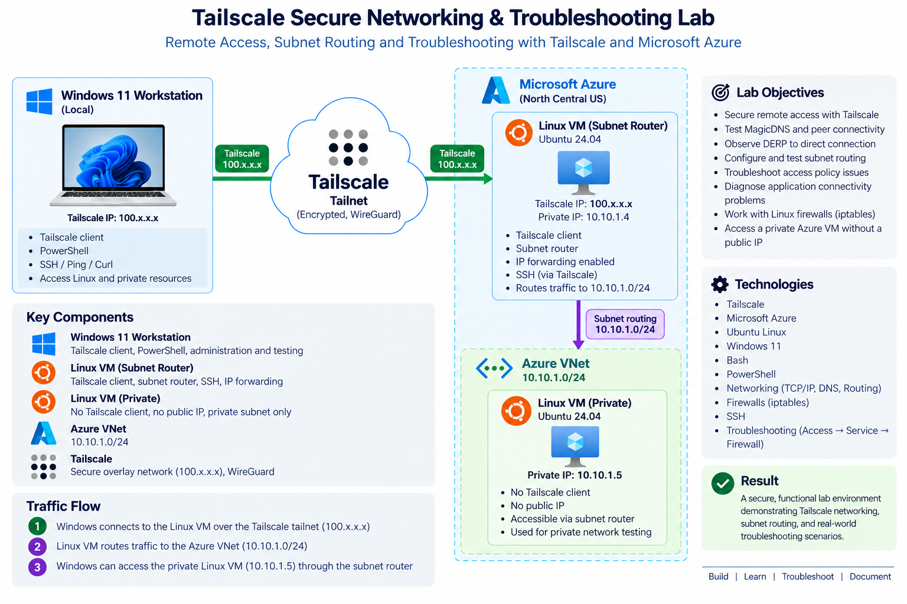

# Tailscale Secure Networking & Troubleshooting Lab

Hands-on networking and troubleshooting lab using **Tailscale, Microsoft Azure, Linux, Windows, Bash, and PowerShell**.

I built this lab to gain practical experience configuring and troubleshooting Tailscale across Windows and Linux systems, securing remote administration, diagnosing connectivity problems, and extending Tailscale connectivity into a private Azure network.

## Lab Architecture

The environment consisted of:

- Windows 11 workstation (`cyberjam`) running Tailscale
- Ubuntu 24.04 Azure VM (`ts-linux-01`) running Tailscale
- Private Ubuntu Azure VM (`ts-private-test`) without Tailscale or a public IP
- Azure VNet with private subnet (`10.10.1.0/24`)
- Tailscale subnet routing through `ts-linux-01`



## What I Implemented

- Connected Windows and Linux systems through a Tailscale tailnet
- Tested MagicDNS hostname resolution
- Observed DERP-relayed connectivity transition to a direct peer connection
- Used `tailscale status`, `tailscale ping`, and `tailscale netcheck` for diagnostics
- Verified public TCP/22 was blocked by the Azure network configuration while maintaining administrative access with Tailscale SSH
- Tested Tailscale access-policy behavior by removing and restoring an allow grant
- Reproduced and diagnosed an application timeout caused by a Linux host firewall rule
- Used an Access → Service → Firewall troubleshooting workflow to isolate the failure
- Configured `ts-linux-01` as a subnet router for `10.10.1.0/24`
- Reached a private Azure VM that had neither Tailscale installed nor a public IP

## Troubleshooting Scenarios

### Access Policy

I deliberately removed the lab's allow-all access grant while keeping both nodes connected to Tailscale.

The resulting behavior demonstrated that:

- `tailscale status` could still see the peer
- `tailscale ping` could still provide peer/path diagnostics
- Ordinary ICMP traffic failed
- SSH connectivity timed out

Restoring the grant restored ordinary connectivity.

**Key lesson: Connected does not necessarily mean authorized.**

### Application and Firewall Troubleshooting

I ran a temporary HTTP service on TCP 8080 and introduced a targeted Linux firewall DROP rule.

The client experienced a timeout even though the Tailscale nodes were connected.

I isolated the problem using:

**Access policy → Service listening → Firewall**

The service was confirmed listening on `0.0.0.0:8080`, after which inspection of the Linux firewall identified the TCP 8080 DROP rule.

Removing the rule and retesting returned:

```text
HTTP/1.0 200 OK
```

**Key lesson: Prove each layer instead of assuming where the failure is.**

## Subnet Routing

`ts-linux-01` advertised the Azure subnet:

```text
10.10.1.0/24
```

The route was approved in the Tailscale admin console and Linux IPv4 forwarding was enabled.

From the Windows workstation:

```powershell
ping 10.10.1.5
```

successfully reached `ts-private-test` with **0% packet loss**.

Because the target had no Tailscale client and no public IP, the successful test demonstrated connectivity from the Windows tailnet device to the Azure private subnet through the configured subnet router.

## Documentation

Detailed implementation and troubleshooting evidence:

- [Lab Setup](docs/setup.md)
- [Networking and Subnet Routing](docs/networking.md)
- [Troubleshooting Scenarios](docs/troubleshooting.md)
- [Lab Screenshots](screenshots/)

## Technologies

**Tailscale · WireGuard · Microsoft Azure · Linux · Windows · Bash · PowerShell · DNS · IP Routing · Firewalls · SSH · TCP/IP**

## Key Takeaways

This project strengthened my practical understanding of:

- Tailscale peer connectivity and access controls
- Direct versus DERP-relayed connection paths
- MagicDNS and Tailscale addressing
- Network and service-layer troubleshooting
- Host firewall diagnosis
- Secure remote administration with Tailscale SSH
- Subnet routing into private networks
- Evidence-based troubleshooting and verification

