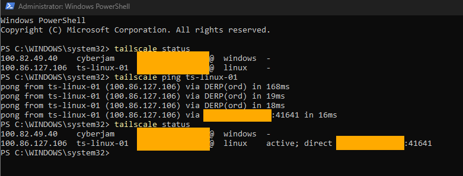
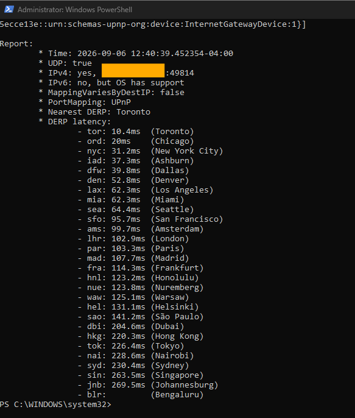
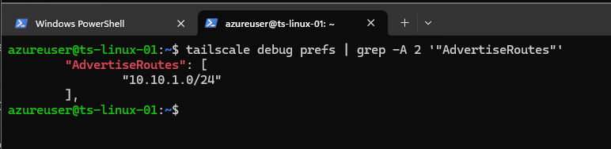
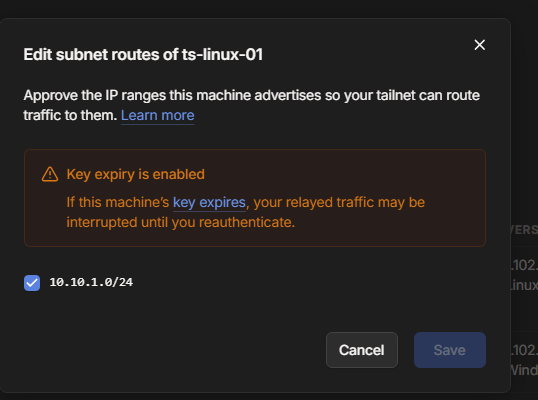
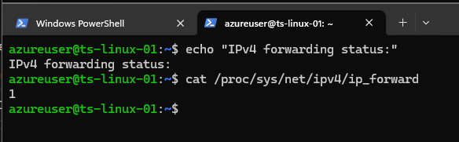
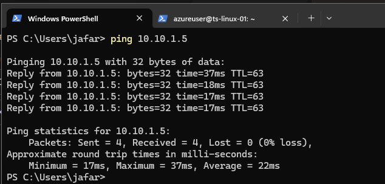

# Networking and Connectivity

## Objective

Validate how Tailscale establishes connectivity between devices, observe direct and DERP-relayed paths, inspect the local network environment, and extend the tailnet to an Azure private subnet using a Tailscale subnet router.

## Direct and DERP Connectivity

Tailscale attempts to establish direct peer-to-peer connectivity between devices when network conditions allow it. When a direct connection cannot initially be established, traffic can use a DERP relay while Tailscale continues attempting to establish a direct path.

From the Windows workstation, I first checked the tailnet:

```powershell
tailscale status
```

I then tested connectivity to the Azure Linux node:

```powershell
tailscale ping ts-linux-01
```

The connection initially used the Chicago DERP relay:

```text
via DERP(ord)
```

After several probes, Tailscale established a direct path to the Azure node. A subsequent `tailscale status` showed the peer as:

```text
active; direct
```



### What This Demonstrated

- DERP can provide an encrypted relay path when a direct connection is not immediately available.
- A DERP connection does not mean the tailnet connection has failed.
- Tailscale can transition from a relayed path to direct peer-to-peer connectivity.
- `tailscale ping` helps identify how Tailscale is reaching a peer.
- `tailscale status` can display the active peer path when traffic is present.

## Network Diagnostics with Netcheck

I used Tailscale's network diagnostic command from Windows:

```powershell
tailscale netcheck
```

The diagnostic reported:

```text
UDP: true
IPv4: yes
IPv6: no, but OS has support
MappingVariesByDestIP: false
PortMapping: UPnP
Nearest DERP: Toronto
```



### Interpretation

**UDP: true**

The current network had usable UDP connectivity. This is important because direct WireGuard-based peer connectivity normally benefits from working UDP.

**IPv4: yes**

The workstation had usable IPv4 connectivity.

**IPv6: no, but OS has support**

The operating system supported IPv6, but usable IPv6 connectivity was not available on the current network. This did not prevent the tailnet from operating over IPv4.

**PortMapping: UPnP**

The local router supported UPnP port mapping, which can assist NAT traversal and help establish direct connectivity.

**Nearest DERP: Toronto**

Toronto had the lowest measured DERP latency during this test. The nearest DERP result identifies the best measured relay candidate; it does not mean current peer traffic is necessarily using that relay.

### Diagnostic Distinction

These commands answer different troubleshooting questions:

- `tailscale status` — What tailnet peers are present, and what path is currently visible?
- `tailscale ping` — Can Tailscale reach this peer, and is the path direct or relayed?
- `tailscale netcheck` — What does the local network environment look like for Tailscale connectivity?

## Azure Subnet Routing

The next objective was to reach a machine inside the Azure VNet that did not have Tailscale installed.

The Azure private subnet used:

```text
10.10.1.0/24
```

The Tailscale-connected Linux VM, `ts-linux-01`, was configured as the subnet router.

The target VM, `ts-private-test`, used:

```text
10.10.1.5
```

The target had:

- No public IP
- No Tailscale client
- Connectivity only through the Azure private network

This allowed the test to demonstrate subnet routing rather than ordinary Tailscale node-to-node communication.

## 1. Advertise the Azure Subnet

The Linux node was configured to advertise:

```text
10.10.1.0/24
```

The advertised route was verified from the Linux CLI:

```bash
tailscale debug prefs | grep -A 2 '"AdvertiseRoutes"'
```

The result showed:

```text
"AdvertiseRoutes": [
        "10.10.1.0/24"
],
```



## 2. Approve the Subnet Route

Advertising a route from a node does not automatically authorize the tailnet to use it.

The advertised `10.10.1.0/24` route was approved in the Tailscale admin console.



This separates the two responsibilities:

**Node advertises → Tailnet administrator approves**

A machine therefore cannot unilaterally claim a network route and automatically have the tailnet trust it.

## 3. Enable Linux IP Forwarding

Because `ts-linux-01` needed to forward traffic between the Tailscale interface and the Azure private network, IPv4 forwarding was enabled on Linux.

The forwarding state was verified with:

```bash
cat /proc/sys/net/ipv4/ip_forward
```

Result:

```text
1
```



A value of `1` confirms that IPv4 forwarding is enabled.

## 4. Validate Private Subnet Connectivity

From the Windows workstation, I tested connectivity directly to the private Azure VM:

```powershell
ping 10.10.1.5
```

The test returned four successful replies with 0% packet loss.



Because `ts-private-test` had neither a public IP nor the Tailscale client installed, this connectivity demonstrated traffic reaching the Azure private subnet through `ts-linux-01`.

The traffic path was:

```text
Windows workstation
        |
        v
Tailscale tailnet
        |
        v
ts-linux-01
Tailscale subnet router
        |
        v
Azure private subnet - 10.10.1.0/24
        |
        v
ts-private-test - 10.10.1.5
```

## Result

The networking exercises demonstrated:

- Direct peer-to-peer Tailscale connectivity
- DERP-relayed connectivity when a direct path was not immediately available
- Transition from DERP to a direct peer path
- Network diagnostics using `tailscale netcheck`
- The difference between peer connectivity and local network diagnostics
- Subnet route advertisement and administrative approval
- Linux IPv4 forwarding
- Access to an Azure private-only machine without installing Tailscale on the target

The subnet-router test extended the tailnet from individual Tailscale devices to a private network behind a Tailscale-connected Linux node.
