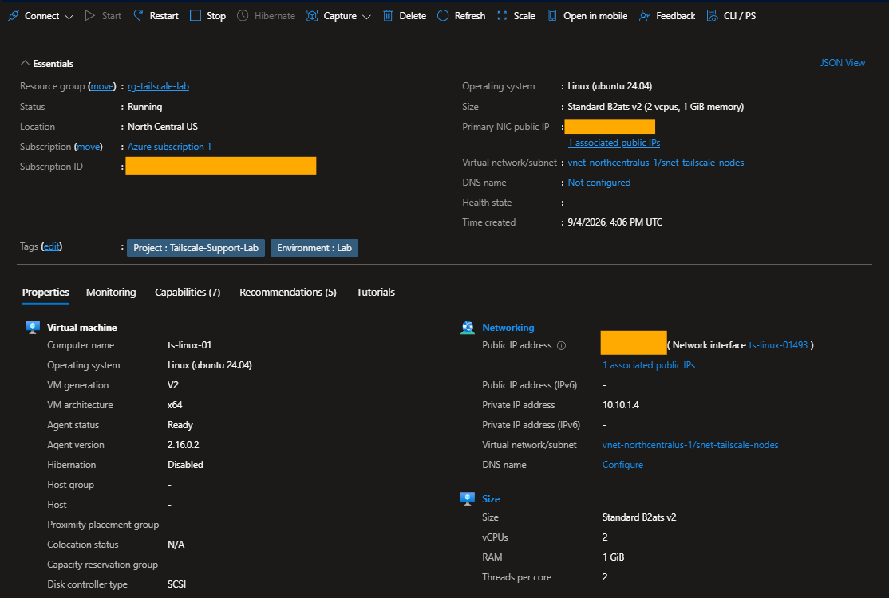
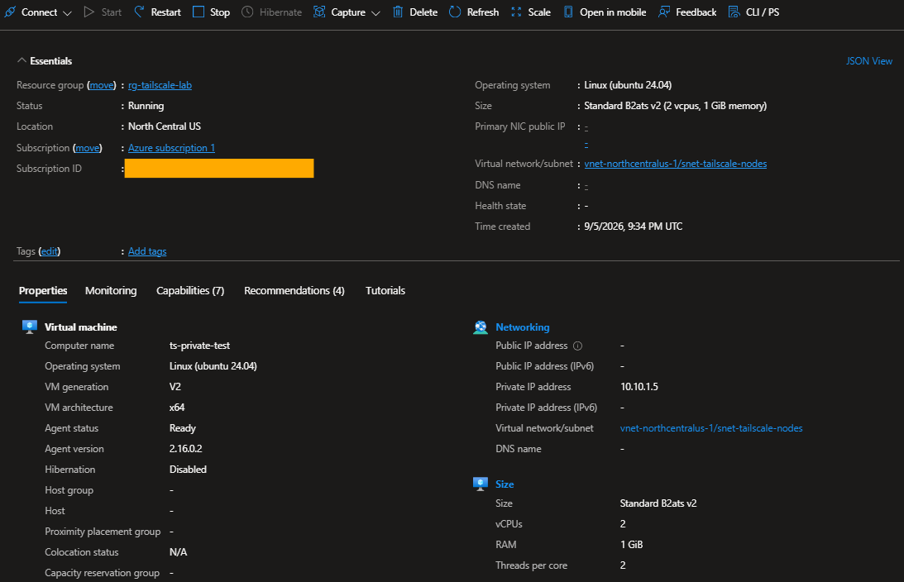
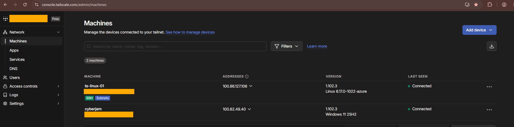
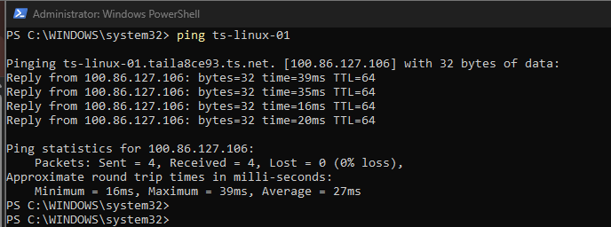
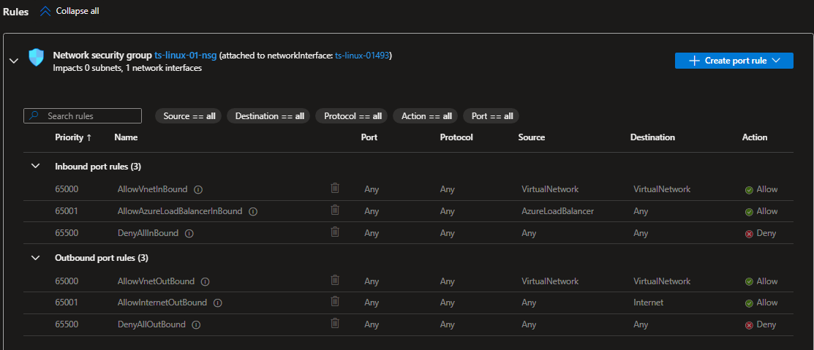
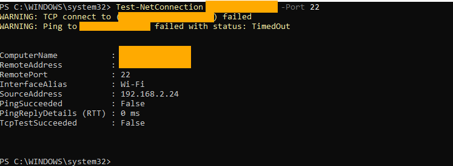
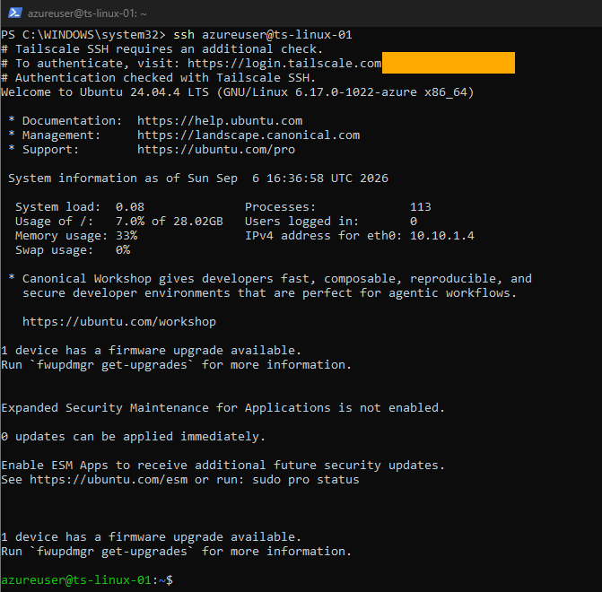

# Lab Setup

## Objective

Build a hands-on Tailscale environment connecting a Windows workstation to Linux infrastructure hosted in Microsoft Azure, then use the environment to test private connectivity, Tailscale SSH, access controls, network diagnostics, firewall troubleshooting, and subnet routing.

## Environment

### Windows Workstation

- OS: Windows 11
- Device name: `cyberjam`
- Tailscale client installed
- Tailscale IP: `100.82.49.40`
- Used PowerShell for connectivity testing and troubleshooting

### Azure Linux VM

- VM name: `ts-linux-01`
- OS: Ubuntu 24.04 LTS
- Azure region: North Central US
- Azure private IP: `10.10.1.4`
- Tailscale IP: `100.86.127.106`
- Connected to Azure VNet `vnet-northcentralus-1`
- Connected to subnet `snet-tailscale-nodes`
- Tailscale SSH enabled
- Configured as a Tailscale subnet router for `10.10.1.0/24`



### Private Azure Test VM

- VM name: `ts-private-test`
- OS: Ubuntu 24.04 LTS
- Azure private IP: `10.10.1.5`
- No public IP
- Tailscale not installed
- Used as a private-only target for validating subnet routing



## Tailscale Nodes

After installing and authenticating Tailscale on the Windows workstation and `ts-linux-01`, both devices appeared as connected machines in the Tailscale admin console.



The environment provided three distinct addressing contexts:

- Azure public IP — Internet-facing connectivity
- Azure private `10.10.1.0/24` network — communication inside the Azure VNet
- Tailscale `100.x` addresses — private tailnet connectivity between Tailscale nodes

## MagicDNS

MagicDNS allowed the Linux VM to be addressed by hostname instead of manually entering its Tailscale IP.

```powershell
ping ts-linux-01
```

The hostname resolved to its Tailscale IP:

```text
ts-linux-01.taila8ce93.ts.net
100.86.127.106
```



## Public SSH Restriction

The Azure Network Security Group did not contain a custom inbound rule permitting public TCP/22 access.



Public SSH reachability was tested from Windows:

```powershell
Test-NetConnection <public-ip> -Port 22
```

The result showed:

```text
TcpTestSucceeded : False
```



## Tailscale SSH

Administrative access was instead performed through the tailnet using Tailscale SSH:

```powershell
ssh azureuser@ts-linux-01
```

Tailscale SSH required an identity check and successfully authenticated the session without using a local SSH private key.



## Result

The initial environment established:

- Private connectivity between Windows and Linux through Tailscale
- MagicDNS hostname resolution
- Public TCP/22 access blocked by the Azure network configuration
- Administrative SSH access through Tailscale SSH
- An Azure private-only VM available for later subnet-routing validation

The remaining lab exercises focus on connection-path diagnostics, access-control troubleshooting, host firewall troubleshooting, and subnet routing.
