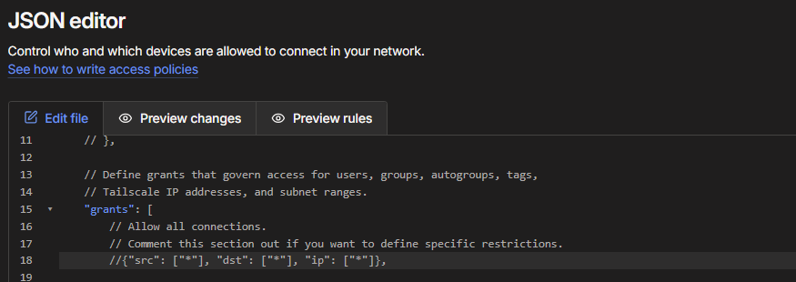
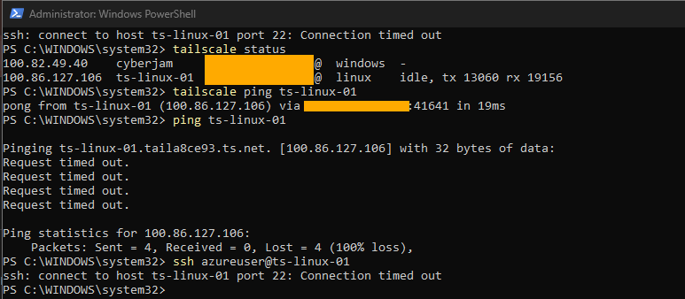
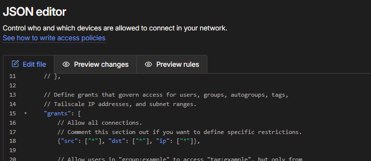
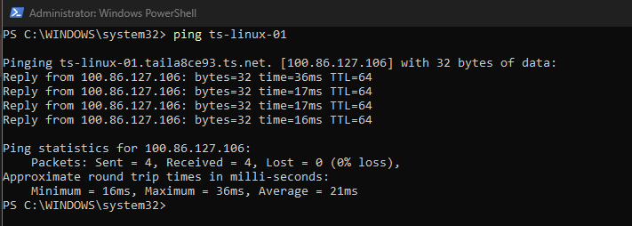
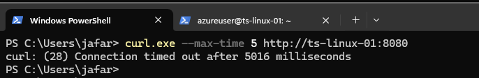
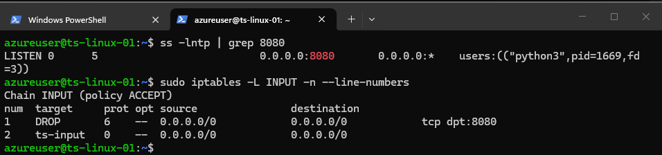
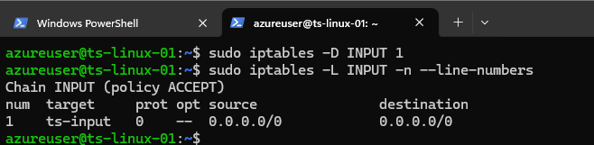
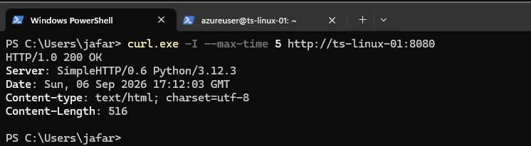

# Troubleshooting Scenarios

## Objective

Deliberately introduce connectivity failures into the lab, troubleshoot them layer by layer, identify the root cause, apply a fix, and verify recovery.

The exercises focused on two common troubleshooting areas:

1. Tailscale access policy
2. Application connectivity and host firewall rules

---

# Scenario 1: Connected Does Not Mean Authorized

## Problem

Both the Windows workstation and Linux VM were connected to the tailnet.

The default Tailscale grant allowed all traffic:

```json
{"src": ["*"], "dst": ["*"], "ip": ["*"]}
```

To reproduce an authorization problem, I commented out the allow-all grant:

```json
// {"src": ["*"], "dst": ["*"], "ip": ["*"]}
```



This did not explicitly create a deny rule. Instead, it removed the grant that permitted ordinary tailnet traffic.

## Test 1: Check Tailnet Status

From Windows:

```powershell
tailscale status
```

The Linux VM still appeared in the tailnet.

This showed that removing the traffic grant did not remove or disconnect the device from Tailscale.

## Test 2: Run Tailscale Ping

I then ran:

```powershell
tailscale ping ts-linux-01
```

Tailscale ping successfully reached the Linux peer and reported the connection path.

This demonstrated that `tailscale ping` can provide peer-connectivity and path diagnostics even when ordinary IP traffic is not permitted by the access policy.

## Test 3: Test Ordinary Traffic

A normal ICMP test was then performed:

```powershell
ping ts-linux-01
```

The result was:

```text
Packets: Sent = 4, Received = 0, Lost = 4 (100% loss)
```

SSH connectivity was also tested:

```powershell
ssh azureuser@ts-linux-01
```

The connection timed out on TCP/22.



The combined results demonstrated an important distinction:

**Connected to the tailnet does not automatically mean authorized for ordinary network traffic.**

It also demonstrated that a successful `tailscale ping` does not prove that a specific application or service is reachable.

## Remediation

The allow-all grant was restored:

```json
{"src": ["*"], "dst": ["*"], "ip": ["*"]}
```



Ordinary connectivity was then tested again:

```powershell
ping ts-linux-01
```

The result returned four successful replies with 0% packet loss.



## Root Cause

The nodes remained connected to Tailscale, but the access policy no longer contained a grant permitting ordinary traffic between them.

## Resolution

Restore an appropriate access grant and verify connectivity again.

## Lesson

When a device appears connected but normal traffic fails, do not assume that the node itself is offline.

Check whether the access policy actually permits the attempted traffic.

---

# Scenario 2: Application Reachability Failure on TCP 8080

## Problem

A temporary HTTP service was started on the Linux VM:

```bash
python3 -m http.server 8080
```

From Windows, the service was initially reachable through the tailnet:

```powershell
curl.exe http://ts-linux-01:8080
```

A temporary Linux firewall rule was then introduced to reproduce a service-connectivity failure:

```bash
sudo iptables -I INPUT 1 -i tailscale0 -p tcp --dport 8080 -j DROP
```

The Windows workstation attempted to reach the service again:

```powershell
curl.exe --max-time 5 http://ts-linux-01:8080
```

The request timed out:

```text
curl: (28) Connection timed out after 5016 milliseconds
```



## Troubleshooting Method: A-S-F

I used a simple troubleshooting sequence:

**A — Access policy**  
**S — Service listening**  
**F — Firewall**

The goal was to prove each layer rather than immediately assume the cause of the timeout.

## A — Access Policy

The Tailscale access grant had already been restored and permitted traffic between the nodes.

This reduced the likelihood that the Tailscale access policy was causing the TCP 8080 failure.

## S — Service Listening

On the Linux VM, I checked whether the application was actually listening on TCP 8080:

```bash
ss -lntp | grep 8080
```

The result showed:

```text
LISTEN ... 0.0.0.0:8080 ... python3
```

This confirmed that the Python HTTP service was running and listening on TCP 8080.

## F — Firewall

I inspected the Linux INPUT firewall rules:

```bash
sudo iptables -L INPUT -n --line-numbers
```

The output showed:

```text
1    DROP    6    --    0.0.0.0/0    0.0.0.0/0    tcp dpt:8080
2    ts-input
```



At this point:

- Access policy permitted traffic
- The application was listening
- The firewall contained a DROP rule for TCP 8080

The host firewall was therefore identified as the cause of the timeout.

## Remediation

The offending firewall rule was removed:

```bash
sudo iptables -D INPUT 1
```

The INPUT chain was checked again:

```bash
sudo iptables -L INPUT -n --line-numbers
```

The TCP 8080 DROP rule was no longer present.



## Verification

From Windows, I tested the HTTP service again:

```powershell
curl.exe -I --max-time 5 http://ts-linux-01:8080
```

The service returned:

```text
HTTP/1.0 200 OK
```



The successful HTTP response confirmed that removing the firewall rule restored application connectivity.

## Root Cause

A host firewall rule was dropping inbound TCP traffic destined for port 8080 on the Tailscale interface.

## Resolution

Remove the incorrect firewall rule and verify application connectivity from the client.

## Lesson

A reachable Tailscale peer does not guarantee that an application running on that peer is reachable.

When peer connectivity exists but a service fails, troubleshoot the relevant layers systematically:

```text
Access policy
     |
     v
Service listening
     |
     v
Firewall
```

**A → S → F**

This avoids guessing and helps isolate whether the failure is caused by authorization, the application itself, or the host firewall.

---

# Troubleshooting Takeaways

The lab demonstrated several support-oriented troubleshooting principles:

- A connected Tailscale node is not necessarily authorized for ordinary traffic.
- Removing an allow grant is different from creating an explicit deny rule.
- `tailscale ping` is a Tailscale peer/path diagnostic and does not prove that a specific service port is reachable.
- MagicDNS name resolution and application connectivity are separate troubleshooting layers.
- Confirm that a service is listening before blaming the network.
- Inspect host firewall rules when the peer is reachable and the application is listening but the connection still fails.
- Change one relevant variable at a time.
- Verify recovery after applying a fix.
- Use observed evidence to isolate the failing layer instead of troubleshooting by assumption.

The troubleshooting workflow used throughout the lab was:

**Reproduce → Inspect → Isolate → Remediate → Verify**
